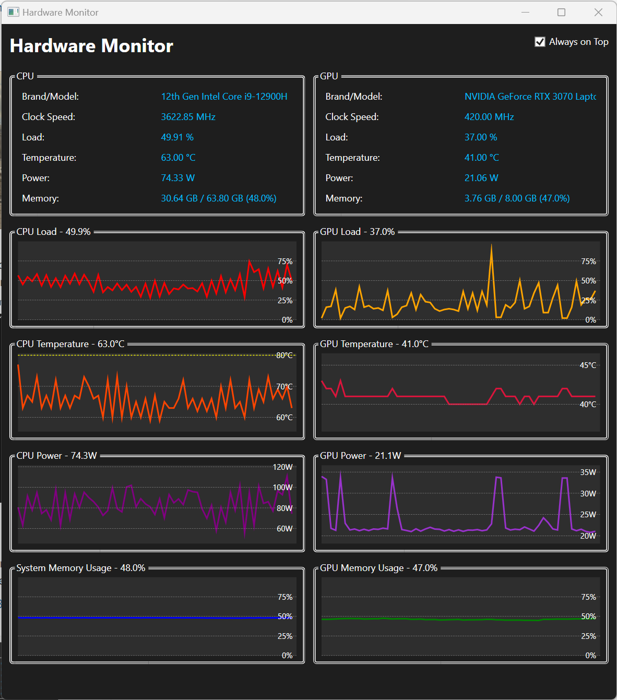

# HardwareMonitor
HardwareMonitor for Windows, a vibe coding experiment

## Screenshot

## Download
You can download the latest release from the [Releases page](https://github.com/haowang1013/HardwareMonitor/releases).

## Features
- Real-time CPU and GPU monitoring
- Temperature, load, and power tracking
- Memory usage statistics
- Historical data visualization
- Always-on-top option

## Requirements
- Windows 10/11
- .NET 6.0 or higher (included in self-contained release)
